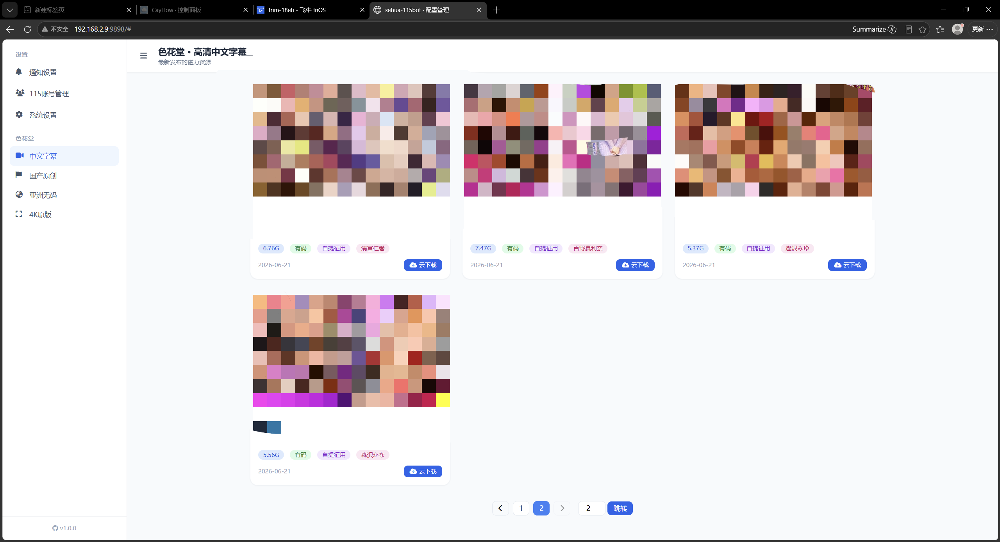

# sehua-115bot
色花自动爬取与 115 网盘离线机器人

> 基于 Golang + Selenium 的全自动色花堂磁力采集与 115 云盘分类下载工具，支持通过 Telegram 机器人实现远程一键触发。

## 📷 前端预览
 
## ✨ 核心功能

- **🤖 Telegram 远程控制**：支持 `/sht`（按日期/页码爬取）、`/zd`（按板块定时自动爬取）等指令，后台静默执行，执行完毕推送总结报告。
- **📥 自动分类离线下载**：自动读取用户预设的 115 根目录，根据色花堂板块（如`高清中文字幕`、`国产原创`）自动创建同名子目录，实现磁力资源**按板块自动分类保存**。
- **🧹 自动垃圾清理**：离线任务结束后，自动调用清理脚本，递归删除目录下小于 `100M` 的垃圾文件，并自动清理空文件夹，保持网盘目录整洁。
- **🔄 增量爬取与断点续爬**：支持 `1-10` 等页码范围，自带爬取日志记录。**无需重复爬取**，遇到中断或重复发号指令，会自动跳过已爬过的页码，只爬取缺失的区间。
- **📸 实时通知反馈**：爬取结束，TG 自动推送磁力卡片（包含海报、标题、演员、大小等详情），并在离线任务全部完成后推送总结报告。

## 🛠️ 技术栈

- **后端服务**：Go (Gin, SQLite)
- **爬虫核心**：Python 3 (Selenium Base, BeautifulSoup, 并发下载)
- **115 交互**：p115client
- **推送通知**：Telegram Bot API

## 🚀 快速开始

  **目前仅支持通过docker命令拉取镜像**

### 使用 Docker Run
```bash
docker run -d \
  --name sehua-115bot \
  --user root \
  --network host \
  -p 9898:9898 \
  -v /opt/sehua/data:/app/data \
  -v /opt/sehua/config.yaml:/app/config.yaml \
  -e TZ=Asia/Shanghai \
  --restart=always \
  cayalume/sehua-115bot:latest
```

### 使用 Docker Compose

```
version: '3.8'

services:
  sehua-115bot:
    image: cayalume/sehua-115bot:latest
    container_name: sehua-115bot
    restart: always
    user: root
    network_mode: host
    # ⚠️ 注意：因为使用了 network_mode: host，容器直接使用宿主机的网络
    # 因此下方的 ports 映射实际上会被 Docker 忽略，可以不写，这里写出来仅作提醒
    ports:
      - "9898:9898"
    volumes:
      # 务必确保宿主机的对应目录和文件存在，否则容器启动会报错
      - /opt/sehua/data:/app/data
      - /opt/sehua/config.yaml:/app/config.yaml
    environment:
      - TZ=Asia/Shanghai
```
## 📝 路径映射说明

| 本地路径 | 容器路径 | 说明 |
| :--- | :--- | :--- |
| /opt/sehua/data | /app/data| 容器数据存放路径 |
| /opt/sehua/config.yaml | /app/config.yaml | 容器各项配置储存路径 |

*  运行容器前确保映射路径有config.yaml这个文件，如果没有务必创建一个同名空文件，否则启动容器会报错
*  安装完成后启动容器:
    - 浏览器输入`http://ip:9898`进入前端配置账号cookie和tg机器人
 - 在 Telegram 中设置默认保存路径：`/setting`。
 - 发送指令开始爬取(指令支持板块id和中文)：
   - 按日期爬取：`/sht 103 日期 2026-06-22`
   - 按页码爬取：`/sht 103 页数 1-5`
   - 设置每日自动任务：`/zd 02:00 4K原版 36 103 151`

## ⚠️ 注意事项

- 由于脚本依赖于 Selenium 和无头 Chrome，部署前服务器请确保内存大于 `2GB` 且网络通畅。
